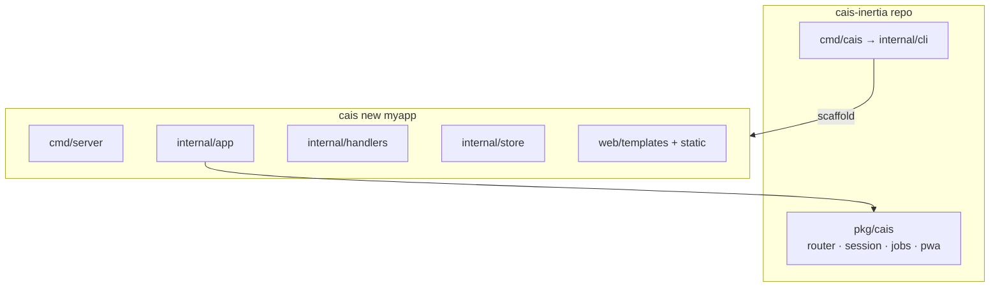

# Cais Inertia

Full-stack Go framework and CLI for mini apps: server-side HTML, HTMX, Tailwind, and SQLite.

This repository ships the **framework and `cais` command only** — not a runnable demo app at the repo root. Scaffold your own app with `cais new`, then run `cais dev` inside that directory.

Forked from [cais](https://github.com/puppe1990/cais) (`module github.com/puppe1990/cais-inertia`).

## Stack

- Go 1.22+ minimum (`net/http` stdlib; `go.mod` may pin a newer toolchain)
- `html/template` + HTMX 2.x (scaffolded apps)
- PWA by default (manifest, service worker, offline page, icons, fullscreen display)
- Open Graph / Twitter preview (`pkg/cais/meta`, default `og.png`)
- Tailwind CSS 3.x (in generated apps)
- SQLite (`modernc.org/sqlite`, no CGO)

## Quick start

```bash
make install-cli          # installs cais to ~/go/bin
export PATH="$HOME/go/bin:$PATH"

make test                 # framework + CLI tests
make build                # bin/cais

cais new myapp ../myapp   # scaffold a new app
cd ../myapp && cais install && cais dev
```

## CI and pre-commit

GitHub Actions runs tests, `golangci-lint`, Prettier, and scaffold smoke on every push/PR to `main`.

```bash
make pre-commit-install   # once: installs git hooks
make ci                   # test + lint + format-check locally
```

## CLI (Rails-style)

| Command                                                                                                                            | Description                                                 |
| ---------------------------------------------------------------------------------------------------------------------------------- | ----------------------------------------------------------- |
| `cais new <app> [dir]`                                                                                                             | Scaffold a new app (home, contact, dashboard)               |
| `cais new <app> [dir] --minimal`                                                                                                   | Slim app (home only)                                        |
| `cais new <app> [dir] --blank`                                                                                                     | Empty app (no starter content)                              |
| `cais new <app> [dir] --module <path>`                                                                                             | Override Go module path                                     |
| `cais g [--dry-run] handler <name>`                                                                                                | Handler + test + page + route                               |
| `cais g [--dry-run] resource <name> [--fields ...] [--public] [--paginate] [--no-seed] [--force] [--admin-auth session or bearer]` | Full CRUD + optional public page                            |
| `cais destroy [--dry-run] resource\|handler\|model <name>`                                                                         | Remove generated files + unpatch routes/store/seeds         |
| `cais destroy [--dry-run] auth`                                                                                                    | Remove login/auth files + revert session middleware         |
| `cais destroy [--dry-run] migration <name>`                                                                                        | Remove `*_<name>.sql` migration file                        |
| `cais g [--dry-run] model <name> [--fields ...]`                                                                                   | Model + migration + store (no handlers/UI)                  |
| `cais g [--dry-run] page <name>`                                                                                                   | Page template only                                          |
| `cais g [--dry-run] migration <name>`                                                                                              | SQL migration file (`-- up` / `-- down`)                    |
| `cais g [--dry-run] auth`                                                                                                          | Add login/logout + protect dashboard                        |
| `cais g [--dry-run] console`                                                                                                       | Scaffold `cmd/console/main.go`                              |
| `cais g [--dry-run] ci`                                                                                                            | Add GitHub Actions CI, pre-commit, lint, Prettier           |
| `cais g [--dry-run] job <name> [--cron "0 3 * * *"]`                                                                               | Background job handler + registry + `cmd/worker`            |
| `cais install`                                                                                                                     | `npm install` + `go mod tidy` (run inside a scaffolded app) |
| `cais css`                                                                                                                         | Build Tailwind CSS                                          |
| `cais dev`                                                                                                                         | Hot reload (`air` + tailwind watch)                         |
| `cais build [--os linux] [--arch amd64] [-o path]`                                                                                 | Build `bin/server` (cross-compile for deploy)               |
| `cais server`                                                                                                                      | Run `go run ./cmd/server`                                   |
| `cais test`                                                                                                                        | Run `go test ./...`                                         |
| `cais console`                                                                                                                     | Interactive REPL (store, cfg, db + SQL)                     |
| `cais routes [--verbose]`                                                                                                          | List HTTP routes from `internal/app/routes.go`              |
| `cais db migrate`                                                                                                                  | Run pending SQL migrations                                  |
| `cais db status`                                                                                                                   | List applied/pending migrations                             |
| `cais db rollback`                                                                                                                 | Roll back last migration (runs `-- down` SQL when present)  |
| `cais db prune-sessions`                                                                                                           | Delete expired login sessions from SQLite                   |
| `cais db seed`                                                                                                                     | Run `internal/db/seeds.go` (idempotent demo data)           |
| `cais db seed --list`                                                                                                              | List seed helpers referenced in `seeds.go`                  |
| `cais jobs work [--queues default,mail] [--concurrency 2]`                                                                         | Run background job worker + dispatcher                      |
| `cais jobs status`                                                                                                                 | Show job counts by status                                   |
| `cais version`                                                                                                                     | Print Cais framework version                                |
| `cais doctor`                                                                                                                      | Check htmx, air, go.mod, CSS (run inside a scaffolded app)  |
| `cais link [../cais-inertia] [--unlink]`                                                                                           | `go mod replace` for local framework dev                    |

Field types: `string`, `text`, `url`, `bool`, `int`, `date`, `references` (or `name:belongs_to`). Suffix `?` for optional.

## Structure (this repo)



```
pkg/cais/          → framework (router, render, config, htmx, validate)
internal/cli/      → generators (cais new, cais g, cais destroy)
cmd/cais/          → CLI entry point
cmd/pwagen/        → PWA asset generator
```

Generated apps add `cmd/server`, `internal/app`, `internal/handlers`, `internal/store`, and `web/`.

## Framework APIs

**Router** — path params and route groups:

```go
r.Get("/blog/{slug}", cais.StringParam("slug", blog.Show))
r.Group(middleware.Protect, func(g *cais.Router) {
  g.Get("/admin/items", admin.Index)
  g.Get("/admin/items/{id}/edit", cais.IntParam("id", admin.Edit))
})
```

**httpx** — less render boilerplate:

```go
httpx.RenderOrError(w, renderer, "base", "home", data, cfg)
httpx.RenderPageOrPartial(w, r, renderer, httpx.RenderOptions{Layout: "base", Page: "contact", Partial: "contact_errors", Data: data, Status: 422}, cfg)
httpx.RenderPartial(w, renderer, "errors", data)
httpx.SeeOther(w, r, "/admin")
```

**meta** — embed `meta.Site` in page data for layout OG tags:

```go
site := meta.SiteFrom("MyApp", cfg.AppURL)
httpx.RenderOrError(w, renderer, "base", "home", PageData{Site: site}, cfg)
```

**testutil** — shared test helpers for scaffolded apps:

```go
renderer := testutil.NewRenderer(t)
req := testutil.NewRequest(http.MethodGet, "/items/1", testutil.PathValue("id", "1"))
testutil.AssertHTMLContains(t, rr.Body.String(), "hello")
```

**Session auth** — cookie-based sessions (7-day expiry, `cais db prune-sessions`):

```go
r.Use(middleware.LoadSession(store))
r.Use(middleware.Flash)
r.Get("/dashboard", middleware.RequireAuth("/login")(dashboard.Index))
session.SignIn(w, store, r, userID, session.CookieOptionsFromConfig(cfg))
```

**Background jobs** — SQLite-backed queue (`pkg/cais/jobs`), no Redis:

```bash
cais g job prune_sessions --cron "0 3 * * *"
cais db migrate
cais jobs work --concurrency 2
```

## Environment variables (scaffolded apps)

| Variable          | Default         | Description                                                              |
| ----------------- | --------------- | ------------------------------------------------------------------------ |
| `PORT`            | `:8080`         | Server port                                                              |
| `DB_PATH`         | `./data/app.db` | SQLite file path                                                         |
| `ENV`             | `development`   | Environment                                                              |
| `APP_URL`         | _(empty)_       | Public base URL for OG/Twitter tags (required in production)             |
| `ADMIN_TOKEN`     | _(empty)_       | Bearer token for admin routes (required in production)                   |
| `LOCALE`          | `en`            | UI locale (`en` or `pt`)                                                 |
| `TRUSTED_PROXIES` | _(empty)_       | Comma-separated proxy IPs for `X-Forwarded-For` (rate limits, client IP) |
| `CAIS_REPLACE`    | _(empty)_       | Local path to Cais framework for `go mod replace` during scaffold        |
| `CAIS_SKIP_TIDY`  | _(empty)_       | Set to `1` to skip `go mod tidy` after scaffold (tests/CI)               |

Deploy guide for generated apps: [docs/deploy/lightsail-systemd.md](docs/deploy/lightsail-systemd.md).

## AI-assisted development

See [AGENTS.md](AGENTS.md) — mandatory TDD, handler conventions, HTMX, store patterns, and development tooling.
