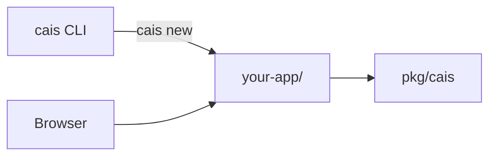

# Go on Cais

Go web framework and CLI for mini apps: **Inertia.js + Svelte**, Tailwind, and SQLite.

**This repository is framework + CLI only.** There is no runnable app at the repo root. Use `cais new` to scaffold an app, then `cais dev` inside that directory.

Fork of [puppe1990/cais](https://github.com/puppe1990/cais) — same `pkg/cais` packages and generators, without the embedded dogfood demo app.

```bash
go install github.com/puppe1990/cais-inertia/cmd/cais@latest
# or from a clone:
make install-cli && export PATH="$HOME/go/bin:$PATH"
```

## Quick start

```bash
git clone https://github.com/puppe1990/cais-inertia.git
cd cais-inertia

make test          # framework + CLI tests
make build         # bin/cais

cais new myapp ../myapp
cd ../myapp && cais install && cais dev   # http://localhost:8080
```

## Stack

| Layer    | Choice                                              |
| -------- | --------------------------------------------------- |
| Runtime  | Go 1.22+ (`net/http` stdlib)                        |
| UI       | Inertia.js + Svelte 5 (Vite → `web/static/build/`)  |
| Server   | [gonertia](https://github.com/romsar/gonertia) v3   |
| CSS      | Tailwind CSS 3.x                                    |
| Database | SQLite (`modernc.org/sqlite`, no CGO)               |
| Mobile   | PWA (manifest, service worker, offline page, icons) |
| Deploy   | Single binary + static assets (Lightsail-friendly)  |

## What's in this repo

```
pkg/cais/       → framework (router, session, csrf, jobs, pwa, validate, …)
internal/cli/   → generators (cais new, cais g, cais destroy)
cmd/cais/       → CLI binary
cmd/pwagen/     → PWA asset generator
```

`cais new` scaffolds a full app with `cmd/server`, `internal/app`, `internal/handlers`, `internal/store`, and `web/`.



## CLI

| Command                                        | Description                                            |
| ---------------------------------------------- | ------------------------------------------------------ |
| `cais new <app> [dir]`                         | Scaffold app (home, contact, dashboard)                |
| `cais new <app> --minimal`                     | Home page only                                         |
| `cais new <app> --blank`                       | Empty shell                                            |
| `cais g handler <name>`                        | Handler + test + page + route                          |
| `cais g resource <name> [--fields ...]`        | Admin CRUD (+ `--public`, `--paginate`)                |
| `cais g auth`                                  | Login/logout + protected dashboard                     |
| `cais g job <name> [--cron "..."]`             | Background job + worker scaffold                       |
| `cais destroy resource\|handler\|model <name>` | Undo generator output                                  |
| `cais db migrate` / `status` / `rollback`      | SQL migrations                                         |
| `cais jobs work` / `status`                    | SQLite job queue worker                                |
| `cais routes [--verbose]`                      | List routes from generated `routes.go`                 |
| `cais doctor`                                  | Check Inertia/Vite, CSS, air (inside a scaffolded app) |
| `cais link [path] [--unlink]`                  | Local `go mod replace` for framework dev               |
| `cais version`                                 | Print framework version                                |

App commands (`cais dev`, `cais server`, `cais build`, `cais css`, `cais install`) run **inside a scaffolded app**, not at the framework repo root.

Field types for `cais g resource`: `string`, `text`, `url`, `bool`, `int`, `date`, `references`. Suffix `?` for optional.

## Framework highlights

**Router** — path params and groups:

```go
r.Get("/blog/{slug}", cais.StringParam("slug", blog.Show))
r.Group(middleware.RequireAuth("/login"), func(g *cais.Router) {
  g.Get("/dashboard", dashboard.ServeHTTP)
})
```

**Inertia** — handlers render Svelte pages via `gonertia`; forms use `@inertiajs/svelte` `useForm`.

**HTMX helpers** — still available in `pkg/cais/` for `cais g resource` admin CRUD (HTML templates) until ported to Svelte.

**Session auth** — cookie sessions, 7-day expiry, `cais db prune-sessions`.

**Jobs** — SQLite-backed queue, no Redis (`pkg/cais/jobs`).

**CSRF** — double-submit cookie on POST/PUT/DELETE/PATCH.

**i18n** — `LOCALE=en` or `LOCALE=pt`.

## Developing the framework

```bash
make test                 # go test ./... -race
make lint                 # golangci-lint
make ci                   # test + lint + prettier
make pre-commit-install   # git hooks (once)
```

CI runs tests, lint, Prettier, and `scripts/smoke-scaffold.sh` (`cais new` → build → test).

Link a scaffolded app to this clone while hacking on the framework:

```bash
cd ../myapp && cais link ../cais-inertia
```

## Environment variables (scaffolded apps)

| Variable          | Default         | Description                                                |
| ----------------- | --------------- | ---------------------------------------------------------- |
| `PORT`            | `:8080`         | Listen address                                             |
| `DB_PATH`         | `./data/app.db` | SQLite file                                                |
| `ENV`             | `development`   | `development` or `production`                              |
| `APP_URL`         | _(empty)_       | Public URL for OG tags (required in production)            |
| `ADMIN_TOKEN`     | _(empty)_       | Bearer token for admin API routes (required in production) |
| `LOCALE`          | `en`            | `en` or `pt`                                               |
| `TRUSTED_PROXIES` | _(empty)_       | Proxy IPs for `X-Forwarded-For`                            |

Deploy guide: [docs/deploy/lightsail-systemd.md](docs/deploy/lightsail-systemd.md).

## AI-assisted development

See [AGENTS.md](AGENTS.md) — TDD conventions, Inertia handler patterns, store, and generator layout.

## License

MIT — see [LICENSE](LICENSE).
