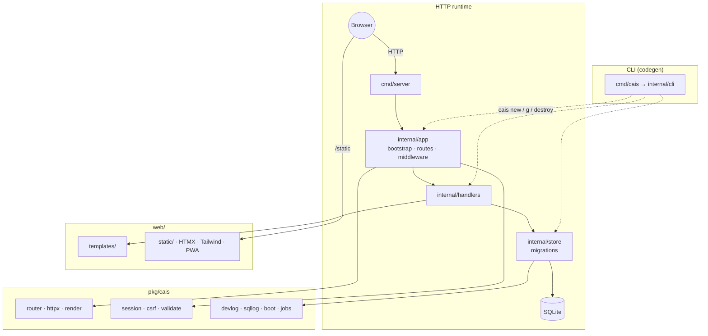

# Cais Inertia


Cais demo app with a **Svelte + Inertia** frontend: Go handlers, gonertia, Vite, and SQLite.

Forked from [cais](https://github.com/puppe1990/cais) — same backend and framework packages; pages are served via Inertia instead of HTMX partials.

## Stack

- Go 1.22+ minimum (`net/http` stdlib; `go.mod` may pin a newer toolchain)
- **Svelte 5 + @inertiajs/svelte** (Vite build → `web/static/build/`)
- **gonertia** server adapter + Inertia root template (`web/templates/app.html`)
- Legacy `html/template` + HTMX still present in `pkg/cais` for framework consumers
- PWA by default (manifest, service worker, offline page, icons, fullscreen display)
- Open Graph / Twitter preview (`pkg/cais/meta`, default `og.png`)
- Tailwind CSS 3.x
- SQLite (`modernc.org/sqlite`, no CGO)

## CI and pre-commit

GitHub Actions runs tests, `golangci-lint`, and Prettier on every push/PR to `main`.

```bash
make pre-commit-install   # once: installs git hooks
make ci                   # test + lint + format-check locally
```

Pre-commit hooks run: trailing whitespace, Prettier, `go fmt`, `go test`, and `golangci-lint`.

## CLI (Rails-style)

Install the `cais` command:

```bash
make install-cli
export PATH="$HOME/go/bin:$PATH"
```

| Command                                                                                                                            | Description                                                |
| ---------------------------------------------------------------------------------------------------------------------------------- | ---------------------------------------------------------- |
| `cais new <app> [dir]`                                                                                                             | Scaffold a new app (home, contact, dashboard)              |
| `cais new <app> [dir] --minimal`                                                                                                   | Slim app (home only)                                       |
| `cais new <app> [dir] --blank`                                                                                                     | Empty app (no starter content)                             |
| `cais new <app> [dir] --module <path>`                                                                                             | Override Go module path                                    |
| `cais g [--dry-run] handler <name>`                                                                                                | Handler + test + page + route                              |
| `cais g [--dry-run] resource <name> [--fields ...] [--public] [--paginate] [--no-seed] [--force] [--admin-auth session or bearer]` | Full CRUD + optional public page                           |
| `cais destroy [--dry-run] resource\|handler\|model <name>`                                                                         | Remove generated files + unpatch routes/store/seeds        |
| `cais destroy [--dry-run] auth`                                                                                                    | Remove login/auth files + revert session middleware        |
| `cais destroy [--dry-run] migration <name>`                                                                                        | Remove `*_<name>.sql` migration file                       |
| `cais g [--dry-run] model <name> [--fields ...]`                                                                                   | Model + migration + store (no handlers/UI)                 |
| `cais g [--dry-run] page <name>`                                                                                                   | Page template only                                         |
| `cais g [--dry-run] migration <name>`                                                                                              | SQL migration file (`-- up` / `-- down`)                   |
| `cais g [--dry-run] auth`                                                                                                          | Add login/logout + protect dashboard                       |
| `cais g [--dry-run] console`                                                                                                       | Scaffold `cmd/console/main.go`                             |
| `cais g [--dry-run] ci`                                                                                                            | Add GitHub Actions CI, pre-commit, lint, Prettier          |
| `cais g [--dry-run] job <name> [--cron "0 3 * * *"]`                                                                               | Background job handler + registry + `cmd/worker`           |
| `cais install`                                                                                                                     | `npm install` + `go mod tidy`                              |
| `cais css`                                                                                                                         | Build Tailwind CSS                                         |
| `cais dev`                                                                                                                         | Hot reload (`air` + tailwind watch)                        |
| `cais build [--os linux] [--arch amd64] [-o path]`                                                                                 | Build `bin/server` (cross-compile for deploy)              |
| `cais server`                                                                                                                      | Run `go run ./cmd/server`                                  |
| `cais test`                                                                                                                        | Run `go test ./...`                                        |
| `cais console`                                                                                                                     | Interactive REPL (store, cfg, db + SQL)                    |
| `cais routes [--verbose]`                                                                                                          | List HTTP routes from `internal/app/routes.go`             |
| `cais db migrate`                                                                                                                  | Run pending SQL migrations                                 |
| `cais db status`                                                                                                                   | List applied/pending migrations                            |
| `cais db rollback`                                                                                                                 | Roll back last migration (runs `-- down` SQL when present) |
| `cais db prune-sessions`                                                                                                           | Delete expired login sessions from SQLite                  |
| `cais db seed`                                                                                                                     | Run `internal/db/seeds.go` (idempotent demo data)          |
| `cais db seed --list`                                                                                                              | List seed helpers referenced in `seeds.go`                 |
| `cais jobs work [--queues default,mail] [--concurrency 2]`                                                                         | Run background job worker + dispatcher                     |
| `cais jobs status`                                                                                                                 | Show job counts by status                                  |
| `cais version`                                                                                                                     | Print Cais framework version                               |
| `cais doctor`                                                                                                                      | Check htmx, air, go.mod, CSS                               |

Field types: `string`, `text`, `url`, `bool`, `int`, `date`, `references` (or `name:belongs_to`). Suffix `?` for optional.

`category_id:references` adds a foreign key to `categories` and renders an admin select (referenced table should have `name` or `title`).

```bash
cais new dashboard ../dashboard
cd ../dashboard && cais install && cais dev
```

## Quick start

Requires Go on your PATH and `~/go/bin` for hot reload (`air`):

```bash
export PATH="$HOME/go/bin:$PATH"
make pwa      # regenerate manifest, icons, og.png, service worker
make dev      # http://localhost:8080 (auto-picks next free port if busy)
make test     # full test suite
make build    # builds bin/cais
make docker   # optimized image
```

## Development experience

Rails-style boot banner on startup (environment, database, listen URL). In development:

- **Port auto-pick** — if `:8080` is busy, shifts to the next free port
- **Request logs** — JSON lines (`kind: request`) in development and production; `LOG_FORMAT=text` for Rails-style
- **SQL logs** — JSON lines (`kind: sql`) via `sqllog.ConfigForEnv` (query, args, duration_ms)
- **`/logs`** — localhost-only log viewer with HTMX auto-refresh (2s)

## Structure



```
pkg/cais/          → framework (router, render, config, htmx, validate)
pkg/cais/meta/     → Open Graph / Twitter preview helpers
pkg/cais/session/  → cookie sessions (SignIn, SignOut, RequireAuth)
pkg/cais/boot/     → startup banner
pkg/cais/devlog/   → /logs viewer + log buffer
pkg/cais/sqllog/   → SQL query logging wrapper
pkg/cais/console/  → interactive REPL (yaegi)
pkg/cais/httpx/    → render and redirect helpers
pkg/cais/forms/    → template helpers (csrfField, fieldError, makeField, fieldInput)
pkg/cais/i18n/     → locale catalogs (LOCALE env)
pkg/cais/pwa/      → PWA asset generator
internal/app/      → bootstrap and routes
internal/handlers/ → HTTP handlers
internal/store/    → SQLite + migrations
web/templates/     → HTML
web/static/        → CSS + JS + PWA assets
cmd/server/        → entry point
```

## Framework APIs

**Router** — path params and route groups:

```go
r.Get("/blog/{slug}", cais.StringParam("slug", blog.Show))
r.Group(middleware.Protect, func(g *cais.Router) {
  g.Get("/admin/items", admin.Index)
  g.Get("/admin/items/{id}/edit", cais.IntParam("id", admin.Edit))
})
```

**httpx** — less render boilerplate:

```go
httpx.RenderOrError(w, renderer, "base", "home", data, cfg)
httpx.RenderPageOrPartial(w, r, renderer, httpx.RenderOptions{Layout: "base", Page: "contact", Partial: "contact_errors", Data: data, Status: 422}, cfg)
httpx.RenderPartial(w, renderer, "errors", data)
httpx.SeeOther(w, r, "/admin")
```

**meta** — embed `meta.Site` in page data for layout OG tags:

```go
site := meta.SiteFrom("MyApp", cfg.AppURL)
httpx.RenderOrError(w, renderer, "base", "home", PageData{Site: site}, cfg)
```

**testutil** — shared test helpers for scaffolded apps:

```go
renderer := testutil.NewRenderer(t)
req := testutil.NewRequest(http.MethodGet, "/items/1", testutil.PathValue("id", "1"))

// Chat handlers (cais g stream chat):
testutil.AssertChatMarkers(t, rr.Body.String())
testutil.AssertHTMLContains(t, rr.Body.String(), "hello", "cais-msg-user")
```

**Admin auth** — Bearer token via `ADMIN_TOKEN` (required when `ENV=production`):

```go
r.Group(middleware.AdminAuth(cfg), func(g *cais.Router) {
  g.Get("/admin/products", admin.Index)
})
```

**Admin auth modes**

| Middleware              | Use case                                                        |
| ----------------------- | --------------------------------------------------------------- |
| `RequireAuth("/login")` | Browser pages (dashboard, `cais g resource` admin CRUD default) |
| `AdminAuth(cfg)`        | API/scripts with Bearer token (`--admin-auth bearer`)           |

Note: `cais g resource` defaults to session auth. Use `--admin-auth bearer` for token-only admin APIs.

Use `--paginate` on `cais g resource` for admin index pagination (25 items per page, HTMX-friendly controls).

**Form helpers** — `pkg/cais/forms` template funcs (registered on the renderer):

```html
{{ csrfField .CSRFToken }} {{ fieldError .Errors "email" }} {{ fieldInput (makeField "email" "Email"
.Email "email" true .Errors) }}
```

`makeField` builds a `forms.FieldData` struct (name, label, value, HTML type, required, error). `fieldInput` renders a labeled input, textarea, or checkbox with error text. Generated admin forms use `fieldInput`/`makeField` by default.

**Validation** — single-field helpers (`validate.Email`, `validate.URL`, `validate.Required`, `validate.MinLength`, `validate.MaxLength`) and `validate.FieldErrors` for forms:

```go
var errs validate.FieldErrors
if name == "" {
  errs.Add("name", "Name is required")
}
if err := validate.MinLength(name, 2); err != nil {
  errs.Add("name", err.Error())
}
if err := validate.Email(email); err != nil {
  errs.Add("email", "Enter a valid email")
}
if errs.Any() {
  httpx.RenderPageOrPartial(w, r, renderer, httpx.RenderOptions{
    Layout: "base", Page: "contact", Partial: "contact_errors",
    Data: map[string]any{"Errors": errs}, Status: 422,
  }, cfg)
  return
}
```

**i18n** — set `LOCALE=en` (default) or `LOCALE=pt` for Portuguese UI strings. See [i18n design](docs/superpowers/specs/2026-07-01-i18n-design.md).

**CSRF** — double-submit cookie on all mutations (enabled by default):

```go
r.Use(middleware.CSRF(cfg))
site := meta.WithCSRF(meta.SiteFrom("MyApp", cfg.AppURL), r)
```

**Session auth** — cookie-based sessions for user-facing apps (7-day expiry, `cais db prune-sessions`):

```go
r.Use(middleware.LoadSession(store))
r.Use(middleware.Flash)
r.Get("/dashboard", middleware.RequireAuth("/login")(dashboard.Index))
session.SignIn(w, store, r, userID, session.CookieOptionsFromConfig(cfg))
flash.Set(w, "notice", "Welcome!", cfg.CookieSecure())
```

**Background jobs** — SQLite-backed queue (`pkg/cais/jobs`), no Redis:

```go
jobs.Enqueue(ctx, store, jobs.Options{Kind: "SendWelcome", Payload: payload})
```

```bash
cais g job prune_sessions --cron "0 3 * * *"   # handler + registry + cmd/worker
cais db migrate                                 # applies jobs + recurring_tasks tables
cais jobs work --concurrency 2                  # worker + delayed-job dispatcher
cais jobs status
```

Built-in handler: `PruneSessions`. On Lightsail, run `cais jobs work` as a second process alongside `bin/server` (same SQLite file).

**Security** — `middleware.SecurityHeaders(cfg)` and `middleware.NewRateLimiter(n)` on login/contact POST routes. Set `TRUSTED_PROXIES` when behind a reverse proxy so rate limits use the real client IP.

**Content-Security-Policy** — production responses include a CSP that allows `'unsafe-inline'` for `script-src` and `style-src`. HTMX and the inline service-worker registration script rely on inline execution; nonce-based CSP would require bundling or refactoring those assets. Treat this as a deliberate tradeoff for server-rendered HTMX apps, not an oversight.

## Environment variables

| Variable          | Default         | Description                                                               |
| ----------------- | --------------- | ------------------------------------------------------------------------- |
| `PORT`            | `:8080`         | Server port                                                               |
| `DB_PATH`         | `./data/app.db` | SQLite file path                                                          |
| `ENV`             | `development`   | Environment                                                               |
| `LOG_FORMAT`      | _(auto)_        | `json` (default in dev/production) or `text` for Rails-style request logs |
| `APP_URL`         | _(empty)_       | Public base URL for OG/Twitter tags (required in production)              |
| `ADMIN_TOKEN`     | _(empty)_       | Bearer token for admin routes (required in production)                    |
| `LOCALE`          | `en`            | UI locale (`en` or `pt`)                                                  |
| `TRUSTED_PROXIES` | _(empty)_       | Comma-separated proxy IPs for `X-Forwarded-For` (rate limits, client IP)  |
| `CAIS_REPLACE`    | _(empty)_       | Local path to Cais framework for `go mod replace` during scaffold         |
| `CAIS_SKIP_TIDY`  | _(empty)_       | Set to `1` to skip `go mod tidy` after scaffold (tests/CI)                |

## Deploy (Lightsail)

```bash
make docker
docker run -p 8080:8080 -v cais-data:/app/data cais:latest
```

Health check: `GET /health` → `{"status":"ok"}` (503 `degraded` if DB is down)

Copy `.env.example` to `.env` for local configuration.

### Behind a reverse proxy

When TLS terminates at nginx, Caddy, or a Lightsail load balancer, set `APP_URL` to the public HTTPS URL and list the proxy's IP in `TRUSTED_PROXIES` so rate limiting and logging use the real client IP from `X-Forwarded-For`:

```bash
ENV=production
APP_URL=https://myapp.example.com
ADMIN_TOKEN=your-secret-token
TRUSTED_PROXIES=127.0.0.1,10.0.0.1
```

## AI-assisted development

See [AGENTS.md](AGENTS.md) — mandatory TDD, handler conventions, HTMX, store patterns, and development tooling.
